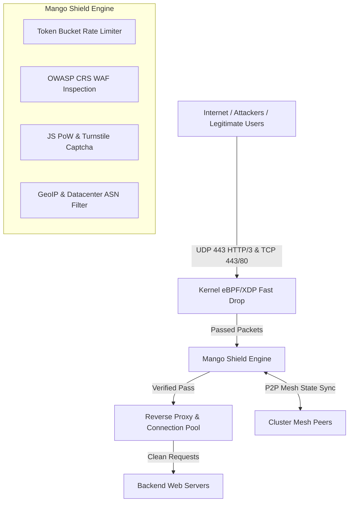

# 🥭 MANGO WAF v3.0 — Enterprise High-Performance Web Application Firewall & DDoS Shield

[](https://golang.org)
[](https://quic-go.net)
[](https://ebpf.io)
[](https://github.com/hashicorp/memberlist)
[](LICENSE)

**Mango WAF v3.0** là hệ thống Tường lửa Ứng dụng Web (WAF) và Lá chắn chống tấn công DDoS cấp doanh nghiệp (Enterprise-grade) được phát triển 100% bằng ngôn ngữ **Go**, hỗ trợ giao thức tân tiến **HTTP/3 (QUIC)**, màng lọc kernel **eBPF/XDP**, đồng bộ P2P Mesh giữa các VPS và cơ chế **Hot-Reload cấu hình thời gian thực**.

---

## 🔥 THÀNH TỰU VÀ CẢI TIẾN NỔI BẬT (v3.0 ENTERPRISE)

- ⚡ **HTTP/3 (QUIC over UDP 443)**: Tích hợp hoàn chỉnh HTTP/3 song song với TCP HTTPS 443, tự động chèn header `Alt-Svc: h3=":443"; ma=86400` giúp tăng tốc độ tải trang lên **3x** và miễn nhiễm với TCP SYN Flood.
- 🛡️ **Kernel-Level eBPF/XDP Filtering**: Lọc và hủy (DROP) các gói tin DDoS cực mạnh ngay tại tầng Network Interface (NIC) trước khi đi vào bộ nhớ Socket Kernel.
- 🔄 **Real-Time Hot-Reloading**: Cập nhật cấu hình bảo mật, danh sách domain, mức WAF Paranoia, Rate Limit RPS/Burst và độ khó PoW trực tiếp trong bộ nhớ RAM mà không cần restart service.
- 🌐 **P2P Mesh Cluster Synchronization**: Các VPS tự động kết nối cụm bằng HashiCorp Memberlist, chia sẻ danh sách IP bị khóa (Ban IP) thời gian thực với độ trễ <10ms.
- 🚀 **Zero-Allocation Pipeline**: Tối ưu hóa bộ nhớ RAM ở mức cực hạn (`0 B/op, 0 allocs/op` ở luồng Inspect WAF Clean), chống sụt giảm CPU/RAM dưới thảm họa tấn công DDoS.
- 🧩 **JS Proof-of-Work & Captcha**: Thử thách PoW tự động thích ứng (<30ms cho trình duyệt thực) cùng giao diện Hold-to-Verify hiện đại chống Botnet dồn dập.

---

## 🏗️ THIẾT KẾ KIẾN TRÚC HỆ THỐNG



---

## ⚡ KHỞI CHẠY NHANH BẰNG DOCKER COMPOSE

### 1. Cài đặt các gói phụ thuộc (Bắt buộc cho XDP eBPF)
Để biên dịch mã nguồn C của XDP ở tầng hạt nhân, hệ thống cần có các trình biên dịch sau:
**Ubuntu / Debian:**
```bash
sudo apt update
sudo apt install -y clang llvm libbpf-dev gcc make linux-headers-$(uname -r)
```
**CentOS / RHEL / AlmaLinux:**
```bash
sudo dnf install -y clang llvm libbpf-devel gcc make kernel-headers
```

### 2. Tải Mã Nguồn & Cấu Hình
```bash
git clone https://github.com/hoangtuvungcao/mango-waf.git
cd mango-waf
```

### 3. Tối ưu hóa Kernel Linux (Rất quan trọng)
Chạy kịch bản tối ưu hóa TCP và thông lượng mạng để chống chịu DDoS mạnh hơn. Kịch bản này nằm trong thư mục `scripts/`:
```bash
sudo chmod +x scripts/optimize_tcp.sh
sudo ./scripts/optimize_tcp.sh
```

### 4. Khởi Chạy WAF
```bash
docker compose up -d --build
```
*Lưu ý: Docker sẽ tự động biên dịch file C trong thư mục `xdp/` và nạp vào card mạng của bạn.*

### 5. Kiểm Tra Trạng Thái
```bash
curl -s http://localhost:9090/api/health
```

---

## 📁 CẤU TRÚC THƯ MỤC VÀ Ý NGHĨA

- `bin/`: Chứa phiên bản đóng gói sẵn (Binary) và file `mango-shield.service` để bạn mang đi chạy trực tiếp trên các máy chủ khác mà không cần cài Docker. Xem `bin/README.md` để biết cách chạy Native (tốc độ tối đa).
- `config/`: Chứa file `config.yaml` và `production.yaml`. Đây là trung tâm điều khiển toàn bộ cấu hình, Rate Limit, Cloudflare API, và các tính năng khác của WAF.
- `xdp/`: Thư mục đặc biệt chứa mã nguồn C (`mango_xdp.c`). Khi khởi động, WAF sẽ gọi trình biên dịch Clang để dịch file này thành mã nhị phân eBPF và cấy vào sâu bên dưới lõi mạng của hệ điều hành Linux (Card mạng). Điều này giúp cắt đứt hàng triệu luồng DDoS mỗi giây mà không tốn 1% CPU nào!
- `scripts/`: Chứa file `optimize_tcp.sh` dùng để nâng giới hạn File Descriptors, tăng bộ đệm TCP và tối ưu TCP BBR cho máy chủ của bạn.
- `core/`: Chứa hàng ngàn dòng code Go định hình luồng Pipeline, Module Bot Detection, Module Cloudflare Banning và hệ thống xử lý song song.

---

## 📖 TÀI LIỆU HƯỚNG DẪN CHI TIẾT

Vui lòng xem tài liệu thiết lập nâng cao tại **[docs/SETUP.md](docs/SETUP.md)**:
- Cấu hình VPS 8 CPU / 8GB RAM tối ưu nhất.
- Hướng dẫn gán Kernel eBPF/XDP vào Card mạng.
- Thiết lập cụm Mesh Multi-Node (Cluster).
- Hướng dẫn sử dụng Dashboard UI & REST API.

---

## 📄 LICENSE

Dự án được phát hành theo giấy phép [MIT License](LICENSE).
