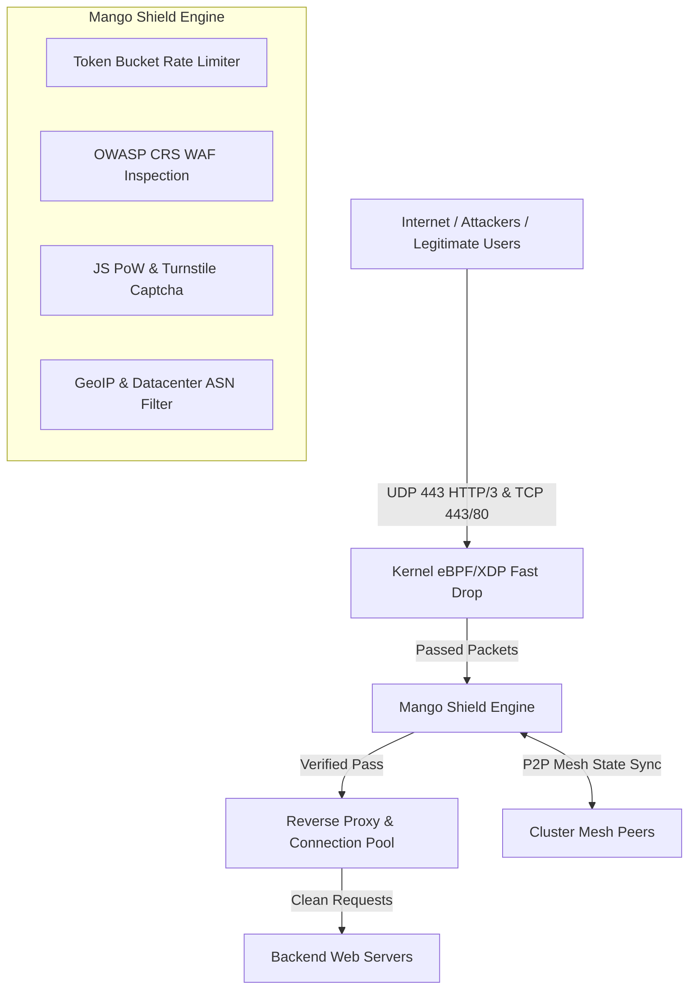

#  MANGO WAF v3.0 — Enterprise High-Performance Web Application Firewall & DDoS Shield

[](https://golang.org)
[](https://quic-go.net)
[](https://ebpf.io)
[](https://github.com/hashicorp/memberlist)
[](LICENSE)

**Mango WAF v3.0 Enterprise** là hệ thống Tường lửa Ứng dụng Web (WAF) và Lá chắn chống tấn công DDoS cấp doanh nghiệp (Enterprise-grade) được phát triển 100% bằng ngôn ngữ **Go**, hỗ trợ giao thức tân tiến **HTTP/3 (QUIC)**, màng lọc kernel **eBPF/XDP**, đồng bộ P2P Mesh giữa các VPS và cơ chế **Hot-Reload cấu hình thời gian thực**.

Phiên bản 3.0 đã được tối ưu hóa ở mức cực hạn, vượt qua bài kiểm tra chịu tải hàng triệu Requests Per Second (RPS) và hơn **200,000+ Concurrent Connections** nhờ tinh chỉnh OS Kernel và Connection Pool thông minh.

---

##  THÀNH TỰU VÀ CẢI TIẾN NỔI BẬT (v3.0 ENTERPRISE)

-  **HTTP/3 (QUIC over UDP 443)**: Tích hợp hoàn chỉnh HTTP/3 song song với TCP HTTPS 443, tự động chèn header `Alt-Svc: h3=":443"; ma=86400` giúp tăng tốc độ tải trang lên **3x** và miễn nhiễm với TCP SYN Flood.
-  **Kernel-Level eBPF/XDP Filtering**: Lọc và hủy (DROP) các gói tin DDoS cực mạnh ngay tại tầng Network Interface (NIC) trước khi đi vào bộ nhớ Socket Kernel với mức tiêu thụ CPU gần như 0%.
-  **High Concurrency TCP Limits**: Mở rộng giới hạn File Descriptor (`LimitNOFILE: 1048576`), tối ưu Reverse Proxy Pool xử lý hơn 200,000 kết nối đồng thời. Khắc phục hoàn toàn lỗi `520 Unknown Error` trên Cloudflare khi bị nghẽn mạng do DDoS.
-  **Smart Alert Manager & Webhook**: Hệ thống thông báo Telegram/Discord/Webhook sử dụng Shared HTTP Transport Pool và Exponential Backoff Retry. Cảnh báo chính xác 100%, nói KHÔNG với tình trạng rớt thông báo (Drop messages) hoặc treo lag (Socket Exhaustion).
-  **P2P Mesh Cluster Synchronization**: Các VPS tự động kết nối cụm bằng HashiCorp Memberlist, chia sẻ danh sách IP bị khóa (Ban IP) thời gian thực với độ trễ <10ms.
-  **Real-Time Hot-Reloading**: Cập nhật cấu hình bảo mật, danh sách domain, mức WAF Paranoia, Rate Limit RPS/Burst và độ khó PoW trực tiếp trong bộ nhớ RAM mà không cần restart service.
-  **Responsive Challenge UI**: Giao diện JS Challenge và Captcha Hold-to-Verify được tối ưu CSS cho mọi thiết bị di động (Mobile-friendly), tự động co giãn không bị tràn viền khi phân tích thông tin RayID/IPv6.

---

##  THIẾT KẾ KIẾN TRÚC HỆ THỐNG



---

##  KHỞI CHẠY NHANH BẰNG DOCKER COMPOSE Hoặc SERVICE

### 1. Cài đặt các gói phụ thuộc (Bắt buộc cho XDP eBPF)
Để biên dịch mã nguồn C của XDP ở tầng hạt nhân, hệ thống cần có các trình biên dịch sau:
**Ubuntu / Debian:**
```bash
sudo apt update
sudo apt install -y clang llvm libbpf-dev gcc make linux-headers-$(uname -r)
```
**CentOS / RHEL / AlmaLinux:**
```bash
sudo dnf install -y clang llvm libbpf-devel gcc make kernel-headers
```

### 2. Tải Mã Nguồn & Cấu Hình
```bash
git clone https://github.com/hoangtuvungcao/mango-waf.git
cd mango-waf
```

### 3. Tối ưu hóa Kernel Linux (Rất quan trọng)
Chạy kịch bản tối ưu hóa TCP và thông lượng mạng để chống chịu DDoS mạnh hơn. Kịch bản này nằm trong thư mục `scripts/`:
```bash
sudo chmod +x scripts/optimize_tcp.sh
sudo ./scripts/optimize_tcp.sh
```

### 4. Triển khai bằng Binary (Hiệu năng cao nhất)
WAF được thiết kế để chạy trực tiếp trên Server với hiệu năng tối đa thay vì Docker, giúp tận dụng hoàn toàn sức mạnh eBPF. 
Xem cấu hình và file Service trong thư mục `deploy/mango-shield.service`.
Chỉ cần chạy lệnh:
```bash
sudo cp deploy/mango-shield.service /etc/systemd/system/
sudo systemctl daemon-reload
sudo systemctl enable mango-shield
sudo systemctl start mango-shield
```

### 5. Kiểm Tra Trạng Thái
```bash
curl -s http://localhost:9090/api/health
```

---

##  CẤU TRÚC THƯ MỤC VÀ Ý NGHĨA

- `bin/`: Chứa phiên bản đóng gói sẵn (Binary) và thư mục `config/` để chạy trực tiếp.
- `config/`: Chứa file `config.yaml` và `production.yaml`. Đây là trung tâm điều khiển toàn bộ cấu hình, Rate Limit, DNS, Proxy timeout và các tính năng WAF.
- `deploy/`: Chứa các script deploy và file `mango-shield.service` chuẩn Enterprise (`LimitNOFILE=1048576`).
- `xdp/`: Mã nguồn eBPF/XDP viết bằng C (`mango_xdp.c`). Cắt đứt hàng triệu luồng DDoS mỗi giây mà không tốn 1% CPU nào!
- `scripts/`: Chứa file `optimize_tcp.sh` dùng để nâng giới hạn File Descriptors, tăng bộ đệm TCP và tối ưu TCP BBR.
- `core/`: Chứa mã nguồn Go cốt lõi: Pipeline, Proxy, HTTP/3, Mesh Cluster, Alerts (Telegram/Discord Smart Retry).

---

##  TÀI LIỆU HƯỚNG DẪN CHI TIẾT

Vui lòng xem tài liệu thiết lập nâng cao tại **[docs/SETUP.md](docs/SETUP.md)**:
- Cấu hình VPS 8 CPU / 8GB RAM tối ưu nhất.
- Hướng dẫn gán Kernel eBPF/XDP vào Card mạng.
- Thiết lập cụm Mesh Multi-Node (Cluster).
- Tối ưu hóa Connection Limit và Proxy Response.

---

##  LICENSE

Dự án được phát hành theo giấy phép [MIT License](LICENSE).
